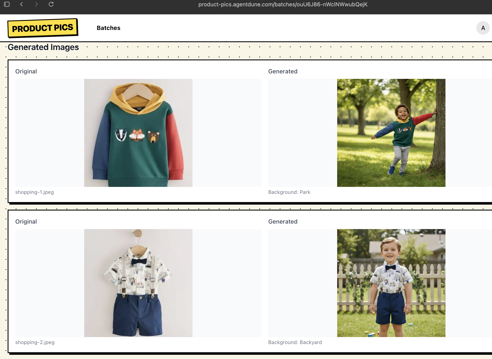

# Product Pics

Product Pics is an AI-powered product photo generator for apparel catalogs. It turns flat product shots into ecommerce-ready lifestyle images by placing age-appropriate models into the scene with varied natural backgrounds.

The app is built for batch catalog work, not one-off image editing. Upload up to 100 product images, choose a demographic and age range, run generation asynchronously, and download the full results as a zip archive.

## Example Output

The app compares the original source image against the generated lifestyle result inside each batch:



## What It Does

- Generates product photos for apparel catalogs using AI.
- Supports batch uploads of up to 100 source images.
- Lets users choose `baby`, `boy`, `girl`, `man`, or `woman` demographics plus a single age or age range.
- Assigns diverse natural backgrounds across a batch for visual variety.
- Tracks progress while generation jobs run asynchronously.
- Packages completed outputs into a zip file with a summary report.
- Stores uploads and generated images in Cloudflare R2.
- Keeps per-user batch history behind authentication.

## Feature Overview

The higher-level product walkthrough lives in [docs/feature-overview.md](docs/feature-overview.md).

## Architecture

- **Framework:** [Next.js](https://nextjs.org/) 16 + React 19
- **Authentication:** [better-auth](https://www.better-auth.com/)
- **Database:** Postgres + [Drizzle ORM](https://orm.drizzle.team/)
- **Storage:** [Cloudflare R2](https://www.cloudflare.com/r2/)
- **Image generation:** [RunPod](https://www.runpod.io/) `nano-banana-edit`
- **Image processing:** [Sharp](https://sharp.pixelplumbing.com/)

## Getting Started

### Prerequisites

- [Node.js](https://nodejs.org/) 18+
- [Bun](https://bun.sh/)
- Postgres database
- Cloudflare R2 bucket
- RunPod API key

### Installation

1. Clone the repository:
```sh
git clone https://github.com/amxv/product-pics.git
cd product-pics
```

2. Install dependencies:
```sh
bun install
```

3. Create `.env.local`:
```env
BETTER_AUTH_SECRET=""
BETTER_AUTH_URL="http://localhost:3000"
NEXT_PUBLIC_BETTER_AUTH_URL="http://localhost:3000"

DATABASE_URL=""

R2_ACCOUNT_ID=""
R2_ACCESS_KEY_ID=""
R2_SECRET_ACCESS_KEY=""
R2_BUCKET_NAME=""
R2_PUBLIC_URL=""

RUNPOD_API_KEY=""
```

4. Start the app:
```sh
bun dev
```

Open `http://localhost:3000`.

## Notes

- User signup is disabled in the current product flow; accounts are expected to be provisioned separately.
- `tmp/` is intentionally gitignored for local scratch assets and experiments.
- The app currently focuses on generation, tracking, and download workflows rather than interactive retouching.
- The current UX is especially strong for apparel workflows where the source image needs to stay faithful to garment color, texture, and branding.

## License

Apache License 2.0. See [LICENSE](LICENSE).
